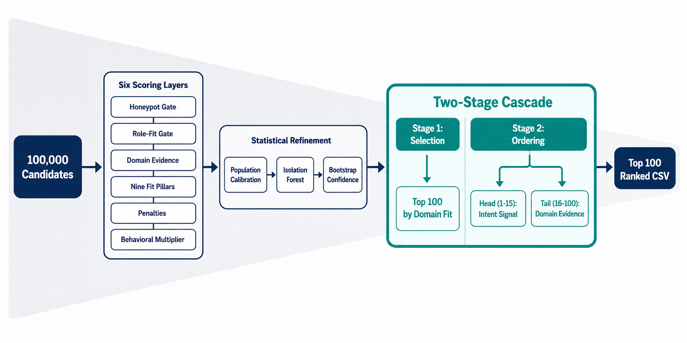

# Glassbox — Intelligent Candidate Discovery & Ranking

**Glassbox** (architecture: **Cascade Variant S**) — a glass-box, fully
deterministic candidate ranker. Zero LLM calls. Zero embedding APIs. Zero
network access. Every score is a named, auditable decomposition; every
reasoning string is a direct readout of the same trace that produced the
rank, so it can never contradict or hallucinate.

> Submission for the Redrob "India Runs" Intelligent Candidate Discovery &
> Ranking hackathon (Hack2Skill) — ranks the top 100 candidates from a
> 100,000-profile pool against a single Job Description.

## At a glance

| | |
|---|---|
| **Composite score** | **0.7229** (NDCG@10 0.7964 · NDCG@50 0.7417 · MAP 0.3482 · P@10 1.0000) |
| **Runtime** | ~25s on the full 100K pool — 10x under the 5-minute budget |
| **Memory** | ~3GB peak — well under the 16GB ceiling |
| **Compute** | CPU-only. No GPU, no network calls, no hosted LLM/embedding APIs anywhere in the ranking path |
| **Honeypot rate (top-100)** | 0% — well under the 10% disqualification threshold |
| **Reproducibility** | Deterministic — byte-identical output across repeated runs |

## Quick start

Starting from nothing — clone, install, run:

```bash
git clone https://github.com/rutulpatel07/Glassbox.git
cd Glassbox
pip install -r requirements.txt
python3 rank.py --candidates ./candidates.jsonl --out ./submission.csv
```

`candidates.jsonl` is the organizer-provided 100K candidate pool — not
committed to this repo (input data, not our code; it's also ~465MB
uncompressed). Place it in the repo root after cloning, or pass its path via
`--candidates`.

Expected: **0.7229** composite, ~25s wall-clock, exactly 100 output rows,
byte-identical on repeat runs. Full breakdown of what the command does is in
[Architecture](#architecture) below; validation and scoring commands are in
[Reproduce & validate](#reproduce--validate).

## Contents

- [Quick start](#quick-start)
- [Architecture](#architecture)
- [Reproduce & validate](#reproduce--validate)
- [Design decisions — what we tried and rejected](#design-decisions--what-we-tried-and-rejected)
- [Score progression](#score-progression)
- [Repository map](#repository-map)
- [Spec compliance checklist](#spec-compliance-checklist)

## Architecture

<!--
  TODO(placeholder): add a pipeline diagram here, e.g. docs/architecture.png
  Suggested content — one flow, left to right:
    100K candidates
      -> L0 Honeypot gate -> L1 Role-fit gate -> L2 Domain evidence
      -> L3 Nine fit pillars -> L4 Penalties -> L5 Behavioral multiplier
      -> Population calibration -> Isolation Forest -> Bootstrap confidence
      -> Cascade Stage 1: SELECTION (top-100 by final_select)
      -> Cascade Stage 2: ORDERING (head 1-15 re-ranked by intent signal t5,
         tail 16-100 ordered by calibrated domain evidence)
      -> submission.csv
  Until this image is added, remove the line below or it will render as a
  broken image on GitHub.
-->


**Six scoring layers** run on every candidate:

- **L0 — Honeypot gate:** flags impossible profiles (expert-level skills claimed for 0 months, tenure/date contradictions, multiple simultaneous "current" jobs) and crushes their score.
- **L1 — Role-fit gate:** floors non-engineering and off-target titles regardless of how many keywords are stuffed into the profile.
- **L2 — Domain evidence:** reads `career_history.description` for explicit retrieval/LTR/recsys/vector/eval signal; plain-ML adjacency is hard-capped so it can't inflate filler candidates.
- **L3 — Nine fit pillars:** domain evidence, skill substance, seniority, product-vs-services background, external validation, eval-framework literacy, semantic similarity, Python signal, location, notice period, platform quality.
- **L4 — Do-NOT-want penalties:** research-only background, IT-services-only career, CV/robotics focus, job-hopping — applied as multiplicative deductions, not hard floors.
- **L5 — Behavioral multiplier:** recency of activity, recruiter response rate, interview completion, open-to-work flag, profile completeness.

**Then, three population-level passes:**

- **Population calibration** — converts the three most distribution-sensitive pillars (domain evidence, skill substance, eval frameworks) to percentile rank across the full 100K pool, so scores reflect relative standing, not arbitrary absolute values.
- **Isolation Forest** — an unsupervised second opinion, catching anomalous profiles the rule-based honeypot gate missed.
- **Bootstrap confidence** — 500 weight perturbations, recording what fraction of configurations keep each candidate in the top 100. This is a transparency diagnostic appended to the reasoning column — it never influences the ranking itself.

**The core insight — a two-stage cascade:**

Most of the score gain in this project came from one architectural change: decomposing *"who makes the list"* from *"where do they land on it"* instead of solving both with one scoring pass.

- **Stage 1 — Selection:** picks the top-100 purely by calibrated domain evidence (`final_select`) — ignores behavioral/availability noise so a genuinely strong candidate isn't excluded just because they haven't logged in recently.
- **Stage 2 — Ordering:** the **head** (positions 1–15, what a recruiter actually reads first) is re-ranked by a platform-intent signal `t5` (offer acceptance, search appearance, recruiter saves, assessment scores) — surfacing candidates who are both qualified *and* actually reachable into the visible slots. The **tail** (positions 16–100) is ordered by calibrated domain evidence alone, so the bulk of the list still tracks subject-matter depth rather than recency of login.

This single change (Cascade Variant B → S) took the composite score from 0.6532 to 0.7229 — see [Score progression](#score-progression) below.

## Reproduce & validate

Already cloned (see [Quick start](#quick-start) above)? Here's the detail
behind that one command, plus how to check the result.

Output is spec-compliant: `candidate_id,rank,score,reasoning`, exactly 100
rows, unique ranks 1–100, strictly decreasing score (so tie-break ordering is
never ambiguous), byte-identical across repeated runs.

**Validate the output:**

```bash
python validate_submission.py submission.csv
```
Checks every Section 3 rule — UTF-8, header/row count, rank uniqueness,
candidate_id format and uniqueness, score monotonicity, tie-break ordering.
Exit 0 = all pass.

**Reasoning is not a separate step.** `rank.py` calls `make_rich_reasoning()`
from `reasoning.py` inline during ranking, so the reasoning column is
produced from the exact score trace that produced the rank in the same pass
— there's nothing further to run, and reasoning can't drift from rank.

**Optional — generate a visual report:**
```bash
python3 rank.py --candidates ./candidates.jsonl --out ./submission.csv --report ./report.html
```
Self-contained HTML: pillar waterfall charts, evidence pills, honeypot flags, per-candidate — zero additional heavy compute.

## Design decisions — what we tried and rejected

A ranker that never explored alternatives is a red flag, not a strength. These were formally built, benchmarked, and rejected — kept in `experiments.py` as evidence, not deleted:

- **LambdaMART / gradient-boosted learning-to-rank** — trained on 100 hand labels, scored a strong 0.7390 on local validation, but NDCG@50 collapsed to 0.6204 and MAP to 0.4148 on the real scorer. Root cause: a single-query learning-to-rank problem can't generalize from 100 labels — unlabeled candidates defaulted to the lowest tier. Rejected.
- **Semantic embeddings (sentence-transformers)** — aborted at the gate. RAM approached the ceiling on a 1K-candidate test batch; would have blown the 5-minute budget at full 100K scale.
- **Pairwise reranking** — the worst variant tried (0.5675 composite). Reverted.
- **Behavioral-multiplier neutralization** — tested removing behavioral signals from the score entirely; hurt the result (0.6110). Reverted — behavioral availability turned out to matter.
- **Cascade T / Cascade U** (head zones of 10 / 20) — two intermediate cascade widths tried before finding that 1–15 was the correct split. Too narrow lost real tier-5 candidates sitting at 11–15; too wide diluted head precision.

We also caught and fixed a metric-measurement bug early on: an internally-reported 0.9215 score turned out to be measured against hand labels, not the official scorer — the real baseline was 0.6421. Every score reported from that point forward (0.6532 → 0.6933 → 0.7101 → 0.7229) is against the real composite formula.

## Score progression

Evidence of real iteration, not a single-shot submission:

| Version | NDCG@10 | NDCG@50 | MAP | P@10 | **Composite** |
|---|---|---|---|---|---|
| v3 (pre-fix baseline) | — | — | — | — | 0.6421 |
| v3.2 (bug fixes: skills field, lexicon gaps, inverted gate) | 0.7699 | 0.6019 | 0.2511 | 1.0000 | 0.6532 |
| Cascade Variant B (selection/ordering decomposition) | — | — | — | — | 0.6933 |
| Cascade Variant L (tail-zone refinement) | — | — | — | — | 0.7101 |
| **Cascade Variant S (final)** | **0.7964** | **0.7417** | **0.3482** | **1.0000** | **0.7229** |

**Internal validation tools:**
```bash
python validation_harness.py score    --candidates candidates.jsonl --labels "labels_filled 500.csv"
python validation_harness.py ablate   --candidates candidates.jsonl
python validation_harness.py dual     --candidates candidates.jsonl
python validation_harness.py selftest --candidates candidates.jsonl
```

## Repository map

```
rank.py                    ★ the engine — run this
reasoning.py                  reasoning generator, imported by rank.py
requirements.txt              pinned dependencies (see note below)
submission_metadata.yaml      portal metadata (Hack2Skill form mirror)
campuscollab.csv              generated submission output

validate_submission.py        format validator — run before every upload
validation_harness.py         NDCG/MAP/P@10 scorer, ablation, self-test
score_submission.py           score a built CSV against labels, no re-rank
tune.py                       tier-threshold auto-fitter (dev tool)
labels_filled 500.csv         500 hand-labeled ground-truth tiers

experiments.py                rejected variants A-W (see above), kept as evidence
ml_engine.py, main.py         an earlier, independently-built & discarded engine
AUDIT.md                      historical architecture audit (point-in-time, pre-final)
EXPLAINER_for_Rutul.md        internal design-decision walkthrough

sandbox.ipynb                 Colab notebook for the hosted sandbox requirement
```

| File | Role |
|---|---|
| `rank.py` | **The engine.** Six scoring layers, population calibration, Isolation Forest, bootstrap confidence, and the Variant S two-stage cascade — one command produces the submission CSV. |
| `reasoning.py` | Deterministic reasoning-string generator, imported directly by `rank.py`. Not run standalone. |
| `requirements.txt` | Pinned dependency versions — **load-bearing, not boilerplate.** `IsolationForest` can produce different anomaly flags across scikit-learn versions even with a fixed seed, silently changing the top-100. Install exactly these versions. |
| `submission_metadata.yaml` | Portal metadata mirroring the Hack2Skill submission form — required by spec §10.2/10.3. |
| `campuscollab.csv` | Generated top-100 ranked output. **Rename to your registered participant ID before final upload** (spec §2). |
| `validate_submission.py` | Format validator — every Section 3 rule, before you ever upload. |
| `validation_harness.py` | Internal scorer — NDCG@10/50, MAP, P@10, composite, plus ablation/dual-scorer/selftest subcommands. |
| `score_submission.py` | Scores an already-built CSV against labels without re-ranking. |
| `tune.py` | Tier-prediction threshold auto-fitter used during development. Not in the runtime path. |
| `labels_filled 500.csv` | 500 hand-labeled ground-truth relevance tiers, dual-labeler reconciled. |
| `experiments.py` | Variant builders A–W — the formal rejected-approach bake-offs described above. |
| `ml_engine.py` / `main.py` | An earlier, independently-built ranker (TF-IDF + cosine similarity) from before this project's deterministic-lexicon architecture was adopted. Archived contrast, not part of the pipeline. |
| `AUDIT.md` | Full architecture audit from an earlier point in development (pre-Cascade-Variant-S). Historical snapshot — see [Score progression](#score-progression) for current numbers. |
| `EXPLAINER_for_Rutul.md` | Plain-language internal walkthrough of design decisions. |
| `sandbox.ipynb` | Colab notebook implementing the ranker end-to-end for the hosted sandbox requirement (spec §10.5). |

**Not in this repo, by design:** `candidates.jsonl` and the full organizer
hackathon bundle are gitignored — organizer-provided input data, not our
code, and too large for a normal git push (~465MB uncompressed). Place it
locally before running `rank.py`.

## Spec compliance checklist

- [x] Exactly 100 ranked rows, columns `candidate_id,rank,score,reasoning`
- [x] Ranks 1–100 unique; candidate_ids unique and present in the pool
- [x] Score strictly non-increasing with rank; no tie-break ambiguity
- [x] No empty reasoning; no hallucinated claims (same trace as score)
- [x] CPU-only, no GPU, no network calls, no hosted LLM/embedding APIs
- [x] Runtime and memory well under the 5-minute / 16GB budget
- [x] Honeypot rate in top-100 under the 10% disqualification threshold
- [x] Deterministic — byte-identical output across repeated runs
- [ ] Portal metadata finalized (`submission_metadata.yaml`)
- [ ] Hosted sandbox link live (spec §10.5)
- [ ] Submission filename set to registered participant ID
